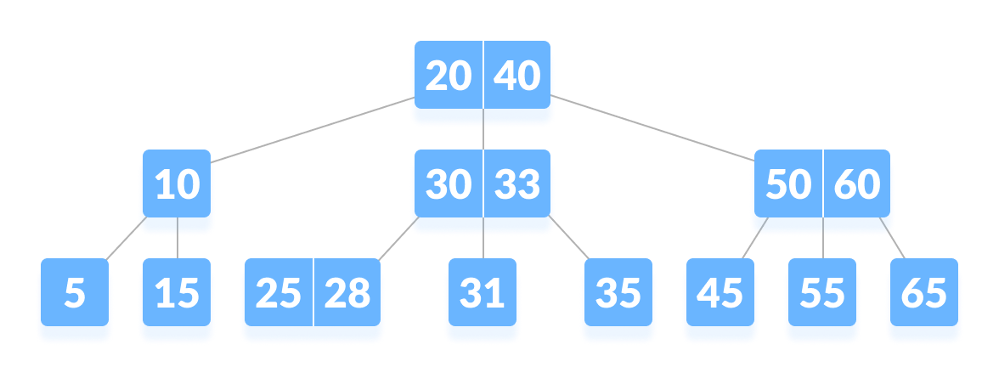

## B Tree

B-tree is a special type of self-balancing search tree in which each node can contain more than one key and can have more than two children. It is a generalized form of the binary search tree.

It is also known as a height-balanced m-way tree.

__Why B-tree?__
The need for B-tree arose with the rise in the need for lesser time in accessing the physical storage media like a hard disk. The secondary storage devices are slower with a larger capacity. There was a need for such types of data structures that minimize the disk accesses.

Other data structures such as a binary search tree, avl tree, red-black tree, etc can store only one key in one node. If you have to store a large number of keys, then the height of such trees becomes very large and the access time increases.

However, B-tree can store many keys in a single node and can have multiple child nodes. This decreases the height significantly allowing faster disk accesses.

For more info [B Trees](https://www.programiz.com/dsa/b-tree)