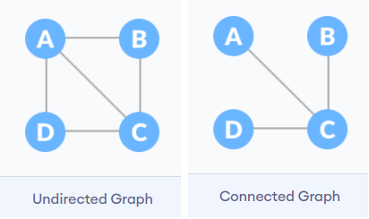
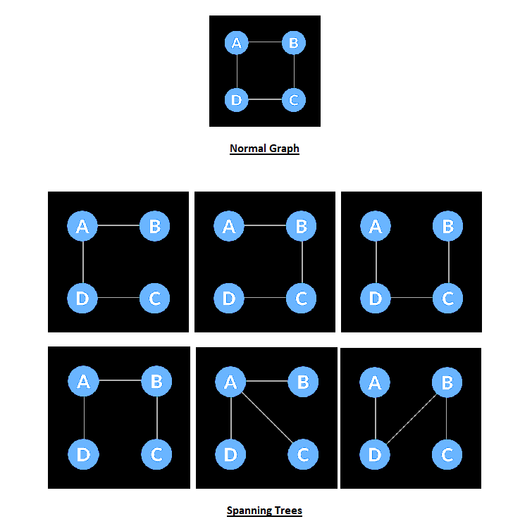
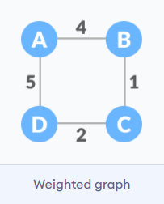
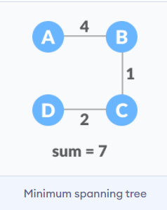

## Spanning Tree and Minimum Spanning Tree

- An __undirected graph__ is a graph in which the edges do not point in any direction (ie. the edges are bidirectional).
- A __connected graph__ is a graph in which there is always a path from a vertex to any other vertex.

## Spanning tree
A spanning tree is a sub-graph of an undirected and a connected graph, which includes all the vertices of the graph having a minimum possible number of edges. If a vertex is missed, then it is not a spanning tree.
The edges may or may not have weights assigned to them.

> The total number of spanning trees with n vertices that can be created from a complete graph is equal to n^(n-2).

If we have n = 4, the maximum number of possible spanning trees is equal to 4^(4-2) = 16. Thus, 16 spanning trees can be formed from a complete graph with 4 vertices.

__Examples Of a Spanning Tree__

### Minimum Spanning Tree
A minimum spanning tree is a spanning tree in which the sum of the weight of the edges is as minimum as possible.

Example of a Spanning Tree

The minimum spanning tree from a graph is found using the following algorithms:
- Prim's Algorithm
- Kruskal's Algorithm

__Spanning Tree Applications__
- Computer Network Routing Protocol
- Cluster Analysis
- Civil Network Planning

__Minimum Spanning tree Applications__
- To find paths in the map
- To design networks like telecommunication networks, water supply networks, and electrical grids.