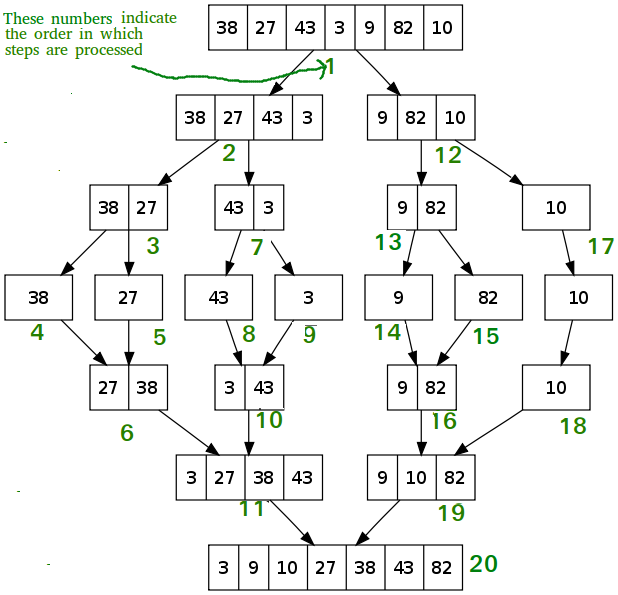

## Merge Sort

Merge Sort is a Divide and Conquer algorithm in computer programming.

### Divide and Conquer Strategy
Using the Divide and Conquer technique, we divide a problem into subproblems. When the solution to each subproblem is ready, we 'combine' the results from the subproblems to solve the main problem.

    MergeSort(arr[], l,  r)
    If r > l
        1. Find the middle point to divide the array into two halves:  
                middle m = (l+r)/2
        2. Call mergeSort for first half:   
                Call mergeSort(arr, l, m)
        3. Call mergeSort for second half:
                Call mergeSort(arr, m+1, r)
        4. Merge the two halves sorted in step 2 and 3:
                Call merge(arr, l, m, r)

### Merge Sort Complexity

__Time Complexity__

__Best Case Complexity: O(n*log n)__
__Worst Case Complexity: O(n*log n)__
__Average Case Complexity: O(n*log n)__

__Space Complexity__
The space complexity of merge sort is __O(n)__.

### Merge Sort Applications

- Inversion count problem
- External sorting
- E-commerce applications