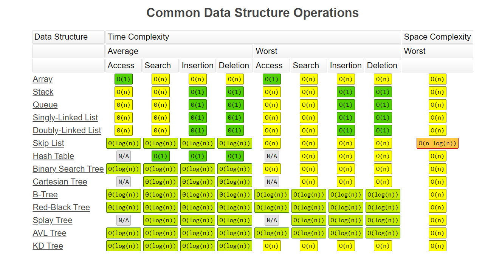
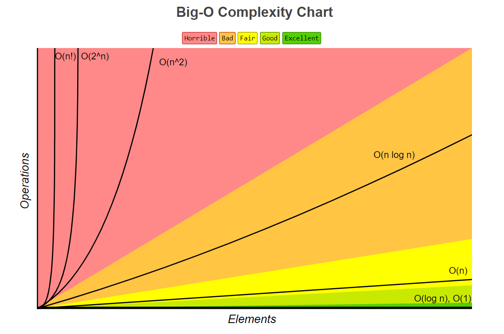

## Data Structures and Algorithms

### Data Structures

Data Structure is a way of collecting and organising data in such a way that we can perform operations on these data in an effective way. Data Structures is about rendering data elements in terms of some relationship, for better organization and storage. 

In Object Oriented programming, a class also does the same thing, it collects different type of data under one single entity. The only difference being, data structures provides techniques to access and manipulate data efficiently.

In simple language, Data Structures are structures programmed to store ordered data, so that various operations can be performed on it easily. It represents the knowledge of data to be organized in memory. It should be designed and implemented in such a way that it reduces the complexity and increases the efficiency.

### Algorithms

An algorithm is a finite set of instructions or logic, written in order, to accomplish a certain predefined task. Algorithm is not the complete code or program, it is just the core logic(solution) of a problem, which can be expressed either as an informal high level description as pseudocode or using a flowchart.

Every Algorithm must satisfy the following properties:

- Input- There should be 0 or more inputs supplied externally to the algorithm.
- Output- There should be atleast 1 output obtained.
- Definiteness- Every step of the algorithm should be clear and well defined.
- Finiteness- The algorithm should have finite number of steps.
- Correctness- Every step of the algorithm must generate a correct output.

An algorithm is said to be efficient and fast, if it takes less time to execute and consumes less memory space. The performance of an algorithm is measured on the basis of following properties :
- Time Complexity - a way to represent the amount of time required by the program to run till its completion.
- Space Complexity - the amount of memory space required by the algorithm, during the course of its execution.

### Common Data Structure Operations

### Common Data Structure Operations

### Big O Complexity Chart

